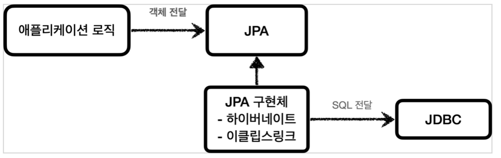

# 1.JDBC 이해

## 1.1 사용된 프로젝트 의존성

- JDBC API
- H2 DataBase
- Lombok

```bash
//build.gradle
	//테스트에서 롬복 사용.
	testCompileOnly 'org.projectlombok:lombok'
	testAnnotationProcessor 'org.projectlombok:lombok'
```

맥인 경우 h2에 실행권한을 줘야함.

```bashs
// h2/bin에서
chmod 755 h2.sh
./h2.sh
```
## 1.2 JDBC 등장 이유

과거에는 각 db마다 스펙(디비와 커넥션 방법, sql전달방법, 결과 응답 방법 등)이 달랐음.

만약 데이터베이스를 변경한다하면 애플리케이션 서버에 개발된 데이터베이스 사용 코드도 함께 변경해야했음.

그래서 개발자는 각각의 데이터베이스마다 커넥션 연결, sql전달, 결과 응답 방법을 새로 습득해야했음.

그래서 등장한게 자바 표준인 JDBC


추상화해서 만들어서 표준 인터페이스를 정의해서 제공.

따라서 개발자는 이 표준 인터페이스만 사용해서 개발하면 됨.

----

#### JDBC 드라이버?

각 DB벤더에서 자신의 db에 맞도록 구현해서 라이브러리로 제공하는데, 이를 JDBC 드라이버 

예시로 Oracle DB에 접근할 수 있는 것은 Oracle JDBC Drvier라고 한다.

----

- 따라서 필요할 경우 JDBC 구현 라이브러리만 변경하면 다른 종류의 DB로 변경해도 애플리케이션 서버의 사용 코드를 그대로 유지할 수 있다.

- 그리고 JDBC 표준 인터페이스만 학습하면 여러 DB에 대한 학습 부담을 줄일 수 있음.

-----
#### JDBC의 한계

DB마다 SQL, 데이터 타입 등의 일부 사용법이 다른데, 일반적인 부분만 공통화 했기 때문에 한계가 있음.
결국 데이터베이스를 변경하면 JDBC 코드는 변경하지 않아도 되지만 SQL은 해당 데이터베이스에 맞도록 변경해야 함.
JPA를 사용하면 다른 SQL을 정의해야 하는 문제도 많은 부분 해결할 수 있음.

-----

## 1.3 JDBC와 최신 데이터 접근 기술

JDBC는 나온지 오래된 기술이므로 현재는 편리하게 사용하는 다양한 방법이 존재한다.

- SQL Mapper
  
  - JDBC를 편리하게 사용할수 있도록 도와주지만, 개발자가 SQL을 직접 작성해야함.
- ORM
  
  - ORM은 객체를 관계형데이터베이스 테이블과 매핑해주는 기술.
  - 때문에 개발자는 반복적인 SQL을 직접 작성하지 않고, 동적으로 SQL을 만들어 실행해준다.

-----
#### SQL Mapper vs ORM

SQL Mapper는 SQL만 직접 작성하면 Mapper가 나머지는 대신해줌. 즉, SQL만 작성할 줄 알면 금방 적용이 가능함.

ORM은 SQL을 직접 작성 하지 않아도 되지만 쉬운 기술이 아니기에 깊이있게 학습을 해야한다.

-----

결국 이런 기술들도 내부에서 JDBC를 사용하기에 JDBC를 직접 사용하지 않더라도 JDBC가 어떻게 동작하는지 기본 원리를 알아둬야한다.!!

**즉, JDBC는 자바개잘자라면 꼭 알아둬야하는 필수 기본 기술이라고 한다.**

그 전에 low단에서 어떻게 돌아가는지 알아야 하기 때문에 직접 사용해보는 실습을 한다.


## 1.4 데이터베이스 연결

h2 DB에 JDBC에 연결.
이 과정은 DriverManager가 라이브러리에 등록된 DB에 URL, Username, password을 다 던져봄.

DriverManager는 라이브러리에 등록된 DB드라이버들을 관리하고, 커넥션을 획득하는 기능을 제공.

거기서 맞는걸 찾아서 연결함.

물론 각 데이터베이스는 JDBC 표준 커넥션 인터페이스인 *java.sql.Connection*인터페이스를 구현하고 있음.


```java
// 
public static final String URL = "jdbc:h2:tcp://localhost/~/test";
public static final String USERNAME = "sa";
public static final String PASSWORD = "";

//
Connection connection = DriverManager.getConnection(ConnectionConst.URL, ConnectionConst.USERNAME, ConnectionConst.PASSWORD);


```

해당 프로젝트에 h2가 등록되어 있으므로 찾아서 연결됨.

## 1.5 JDBC 개발- 등록


코드 객체에서


- Statement는 바인딩이 안되지만
- PrepareStatement는 바인딩이 됨.
- 종료할땐 역순으로 PreparedStatement -> Connection로
- ResultSet은 결과를 조회할 때 사용.
- finally에서 꼭 리소스 정리를 해줘야함.
- prepareStatement()을 사용해야 SQLInject을 방지할 수 있다. 들어오는 값을 데이터로만 처리하므로.


코드가 더럽다.

```java
// JDBC - DriverManager 사용
@Slf4j
public class MemberRepositoryV0 {

    public Member save(Member member)throws SQLException{
        String sql = "insert into member(member_id, money) values (?,?)";

        Connection con = null;
        PreparedStatement pstmt = null;

        try {
            con = getConnection();
            pstmt = con.prepareStatement(sql);
            //값, 타입을 적어줘야함.
            pstmt.setString(1,member.getMemberId());
            pstmt.setInt(2,member.getMoney());
            pstmt.executeUpdate();//query 실행 반환값은 실제 DB에 영향을 미친 row수
            return member;

        } catch (SQLException e) {
            log.error("db error",e);
            throw e;
        }finally {
            close(con,pstmt,null);
        }
    }

    //Statement는 바인딩이 안되지만
    //PrepareStatement는 ?에 바인딩이 됨. 

    private void close(Connection con, Statement stmt, ResultSet rs){

        if(rs != null){
            try {
                rs.close(); /* SQLException */
            } catch (SQLException e) {
                log.info("error",e);
            }
        }

        if(stmt != null){
            try {
                stmt.close(); /* SQLException */
            } catch (SQLException e) {
                log.info("error",e);
            }
        }

        if(con != null){
            try {
                con.close();
            } catch (SQLException e) {
                log.info("error",e);
            }
        }

    }

    private Connection getConnection(){
        return DBConnectionUtil.getConnection();
    }


}

```

## 1.6 JDBC개발- 조회

```java
public Member findById(String memberId) throws SQLException{
        String sql = "select * from member where member_id = ?";

        Connection con = null;
        PreparedStatement pstmt = null;
        ResultSet rs = null;

        try {
            con = getConnection();
            pstmt = con.prepareStatement(sql);
            pstmt.setString(1,memberId);

            //업데이트가 아니므로 excuteQuery() select query
            rs = pstmt.executeQuery();
            //rs 한 번은 호출해줘야함. 처음에는 아무것도 가르키지 않음.
            if (rs.next()){
                Member member = new Member();
                member.setMemberId(rs.getString("member_id"));
                member.setMoney(rs.getInt("money"));
                return member;
            }else{
                throw new NoSuchElementException("member not found memberId = " + memberId);
            }
        }catch(SQLException e){
            log.error("db error",e);
            throw e;
        }finally {
            close(con,pstmt,rs);
        }
    }
```

-----
#### ResultSet ? 


그냥 사진 한방이면 이해가 된다.

rs.next()의 반환값은 true, false

데이터가 있는 경우 true 없으면 false

----

## 1.7 JDBC개발 - 수정,삭제

삭제의 경우 테스트 코드를 어떻게 작성할까?

```java
public void delete(String memberId) throws SQLException{
        String sql = "delete from member where member_id=?";

        Connection con = null;
        PreparedStatement pstmt = null;

        try {
            con = getConnection();
            pstmt = con.prepareStatement(sql);
            //값, 타입을 적어줘야함.
            pstmt.setString(1,memberId);
            pstmt.executeUpdate();//query 실행 반환값은 실제 DB에 영향을 미친 row수

        } catch (SQLException e) {
            log.error("db error",e);
            throw e;
        }finally {
            close(con,pstmt,null);
        }

    }

//Test 코드
Member member = new Member("memberV101", 10000);
repository.save(member);
repository.delete(member.getMemberId());

```

이러면 DB에 없는건 알겠는데 눈으로 직접 확인할 수 없다.

다음 코드를 추가한다.

```java
Assertions.assertThatThrownBy(() -> repository.findById(member.getMemberId()))
                .isInstanceOf(NoSuchElementException.class);
```

NosuchElementException은 findById에서 정의를 했었다. 

만약 없는 값을 조회하는데 NosuchElementException을 던져버리면 사실상 테스트가 성공한것으로 보는것이다.


하지만 이러한 방식은 좋은 방법이 아니다.

위의 로직에서 예외가 터질 경우 로직을 타지 않고, db를 삭제하고 다시 넣어보고 계속 해주는 반복된 작업을 해야하기 때문이다.

이 부분은 트랜잭션을 활용해서 해결할 수 있다고 한다.

그리고 조회, 저장, 삭제를 해보면서 느낀건. 중복된 코드가 너무 많다는 것이다.


