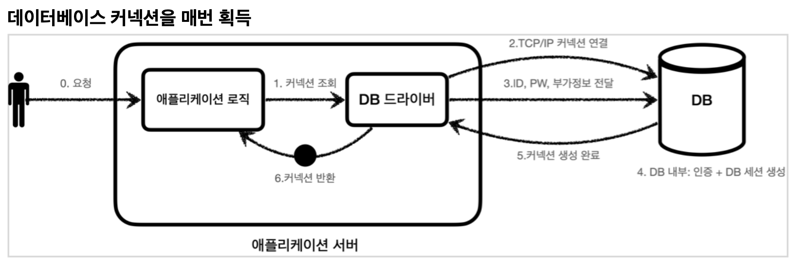
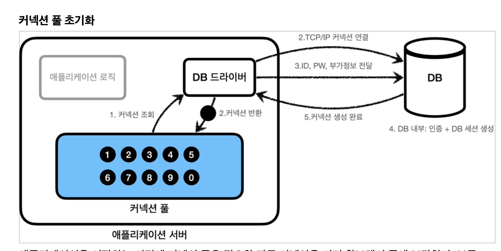

# 2. 커넥션풀과 데이터소스 이해

## 1. 커넥션 풀 이해

기존에는 데이터베이스에서 커넥션을 매 번 획득했다.

  

1. DB 드라이버를 통해 커넥션을 조회
2. DB와 DB드라이버는 TCP/IP커넥션 연결을 한다. 이 과정에서 3way handshake같은 네트워크 동작이 발생한다.
    - 예를들면 앞의 챕터에 URL = "jdbc:h2~" 이런식으로 넘겨줬는데, 이 url정보로 connection할때 네트워크 동작이 발생.
4. DB 드라이버는 TCP/IP 커넥션이 연결되면 ID,PW 등 기타정보를 DB에 전달.
5. DB는 전달받은 정보를 통해 인증을 완료하고 내부에 DB세션을 생성
6. DB는 커넥션 생성이 완료되었다는 응답을 보냄.
7. DB 드라이버는 커넥션 객체를 생성해서 클라이언트에 반환한다.

이러한 과정은 매 번 한다면 TCP/IP 커넥션을 새로 생성하기 위한 리소스를 매번 사용해야하고, SQL에 응답하는 시간 뿐만 아니라 커넥션에 할당되는 시간도 추가되기에 사용자에게 좋지 않은 경험을 줄 수 있다.

데이터베이스마다 다르지만 MySQL계열은 수ms정도지만, 수십 ms초 이상 소요되는 데이터베이스도 존재한다.

이러한 문제를 해결하기 위해 커넥션 풀이라는 것을 사용한다.

어플리케이션을 시작하는 시점에 커넥션 풀은 필요한 만큼 커넥션을 미리 확보해서 풀에 보관한다.

보통 서버스펙에 따라 다르지만 10개정도이다.

  

이렇게 초기에 설저하면 커넥션풀에 들어있는 정보를 통해 DB에 언제든지 TCP/IP 재통신 없이 요청을 보낼 수 있다.

즉, 커넥션풀을 통해서 어플리케이션 로직에서 더이상 DB드라이버를 통해 새로운 커넥션을 획득하지 않고 커넥션 풀에 생성되어 있는 커넥션을 객체 참조로 가져다 쓰기만 하면 된다.

커넥션풀에 커넥션을 요청하면 커넥션 풀은 자신이 가지고 있는 커넥션 중 하나를 반환한다.

요청이 끝났으면 커넥션을 종료하는것이 아닌, 커넥션을 커넥션 풀에 반환하게 된다. 

커넥션을 종료하는 것이 아니고 살아있는 상태로 커넥션 풀에 반환해야 한다는 것이다.


### 정리

- 커넥션 풀은 얻는 이점이 굉장히 크기에 실무에는 항상 기본으로 사용한다.
- 커넥션 풀은 개념적으로 단순해서 직접 구현할 수 있지만 오픈소스의 성능이 훨 좋으므로 오픈소스를 쓰자.
- commons-dbcp2, tomcat-jdbc pool, HikariCP 등이 있는데, HikariCP가 편리함, 안정성 측면에서 검증되었기에 HikariCp를 사용하자.

## 2. DataSource의 이해

참고로 기존에 DriverManager를 사용하고 있다가 커넥션풀로 바꾸려면 로직 자체를 수정해야한다.

만약 HikariCP를 사용한다면 의존관계가 DriverManager에서 HikariCP로 바뀌기 때문이다.

물론 사용법의 차이도 있을 것이다.

자바는 이러한 문제를 해결하기 위해 *java.sql.DataSource*라는 인터페이스를 제공한다.

DataSource는 커넥션을 획득하는 방법을 추상화 하는 인터페이스다.

```java
public interface DataSource{
    Connetion getConnection() throws SQLException;
}
```

뭐 대충 이런식이다.

### 정리

- 대부분의 커넥션 풀은 DataSource를 구현해두었으므로 커넥션풀의 코드에 의존하는 것이 아닌, DataSource의 인터페이스에 의존하도록 설계하면 된다.
- 커넥션 풀의 구현 기술을 바꾸고 싶을땐 해당 구현체로 갈아끼우면 된다.
- DriverManager는 DataSource 인터페이스를 사용하지 않으므로 코드 수정을 직접 해줘야한다. 
  - 스프링은 DriverManager도 DataSource를 사용할 수 있도록 DriverManagerDataSource라는 클래스를 제공
